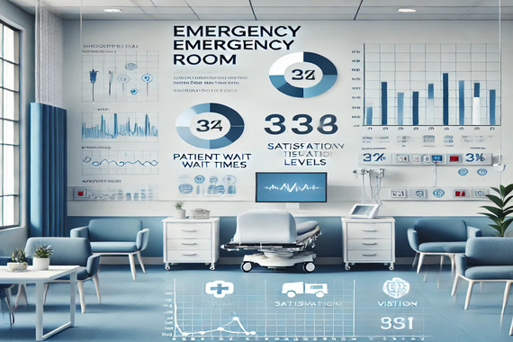

# 🚑 Hospital Emergency Room Patient Report

> 

## 📊 Overview
This project focuses on analyzing patient wait times and satisfaction levels in Mercy General Hospital’s Emergency Room using Microsoft Power BI. The aim is to identify bottlenecks, optimize resource allocation, and enhance overall patient experience.

## 📌 Features
✅ Interactive Power BI dashboard
✅ Breakdown of patient demographics
✅ Data-driven recommendations for hospital efficiency

## 📂 Data
The dataset includes patient wait times, demographics, satisfaction scores, and referral details.

## 🛠️ Implementation
The project has been implemented using PowerBI  
It is available in this repository  
> [RepositoryLink](https://github.com/aashritha-nelavelli/HospiotalRoom-Analysis/blob/main/HospitalReport.pdf)  
📎 View the Power BI Dashboard: [Click] (https://app.powerbi.com/view?r=eyJrIjoiYjJmNTAxNDMtZTEzZS00MjAwLWFlZTEtNWQ2YjliNGRhMmNjIiwidCI6IjExMTNiZTM0LWFlZDEtNGQwMC1hYjRiLWNkZDAyNTEwYmU5MSIsImMiOjN9)

## 🚀 Future Improvements
🔹 Reduce patient wait times through better scheduling
🔹 Increase feedback participation for deeper insights
🔹 Optimize specialized department referrals

Hope this repository was helpful!  
Do star the repository incase you liked it.  
Thank You :)
